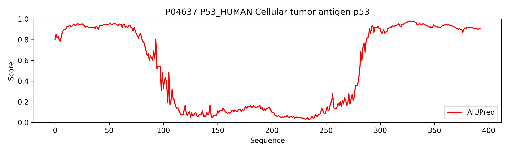
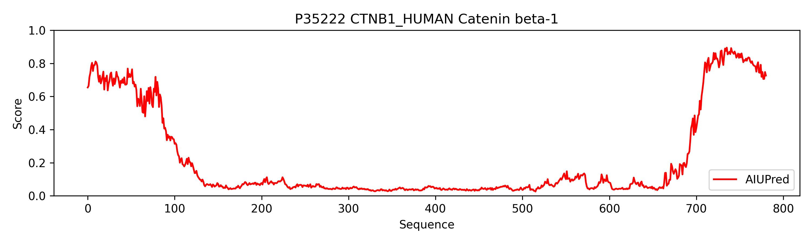

# AIUPred 
disorder prediction method v0.9

[About](#about)

[How to install](#install)

[How to run](#single_pred)

[AIUPred as an importable library](#multi_pred)

[Benchmarks](#benchmark)


## <a name="about">About</a>

Intrinsically disordered proteins (IDPs) have no single well-defined tertiary structure under native conditions. AIUPred is a tool that allows to identify disordered protein regions. 

AIUPred contains a standalone executable script as well as and importable python library.

AIUPred is also available as a webserver (https://aiupred.elte.hu/)

For more information please refer to the publication: [AIUPred: combining energy estimation with deep learning for the enhanced prediction of protein disorder](https://academic.oup.com/nar/advance-article/doi/10.1093/nar/gkae385/7673484)

### Requirements

```
torch~=2.0.1
numpy~=1.26.0
```

## <a name="install">How to install</a>

<b>It is recommended to use a virtual environment</b>

After the environment is ready install the required libraries:

`pip3 install -r requirements.txt`


## <a name="single_pred">How to run</a>

AIUPred contains an executable python script which calls the supplied library as 
well as a FASTA formatted file containing two protein sequences.

In order to carry out an analysis use the following command

`python3 aiupred.py -i test.fasta`

Expected output:

```
# AIUPred v0.9
# Gabor Erdos, Zsuzsanna Dosztanyi
# For in house use only

>sp|P04637|P53_HUMAN Cellular tumor antigen p53 OS=Homo sapiens OX=9606 GN=TP53 PE=1 SV=4
1       M       0.8014
2       E       0.8527
3       E       0.8157
4       P       0.8313
5       Q       0.7959
6       S       0.7855
7       D       0.8402
8       P       0.8788
...
```

Available options for the executable are the following:

```
-h, --help            show this help message and exit
-i INPUT_FILE, --input_file INPUT_FILE
Input file in (multi) FASTA format
-o OUTPUT_FILE, --output_file OUTPUT_FILE
Output file
-v, --verbose         Increase output verbosity
-g GPU, --gpu GPU     Index of GPU to use, default=0
--force-cpu           Force the network to only utilize the CPU. Calculation will be very slow, not recommended
```


## <a name="multi_pred">Programmatic usage</a>

AIUPred contains a loadable python library. The following section gives some tips how to use the importable library. First download and extract AIUPred and add its location to your PYTHONPATH environment variable (assuming standard bash shell)

`export PYTHONPATH="${PYTHONPATH}:/path/to/aiupred/folder"`

After reloading the shell AIUPred will be importable in your python scripts.
```python
import aiupred_lib
# Load the models and let AIUPred find if a GPU is available.     
embedding_model, regression_model, device = aiupred_lib.init_models()
# Predict disorder of a sequence
sequence = 'THISISATESTSEQENCE'
prediction = aiupred_lib.predict_disorder(sequence, embedding_model, regression_model, device,
                                          smoothing='savgol')
```

The bottleneck of the method in terms of speed is the loading of `embedding_model` and `regression_model` 
so by keeping them in memory we can speed up the analysis significantly for future proteins. 

Depending on the length of the sequence AIUPred can use an 
excessive amount of memory. In case you run out of memory AIUPred
is supplied with an approximation function which uses variable length
chunks of the input protein to save memory, then concatenates the results

```python
import aiupred_lib
# Load the models and let AIUPred find if a GPU is available.     
embedding_model, regression_model, device = aiupred_lib.init_models()
# Predict disorder of a sequence
sequence = 'THISISATESTSEQENCE'
prediction = aiupred_lib.low_memory_predict(sequence, embedding_model, regression_model, device,
                                          smoothing='savgol')
```
Please note, that the results of the low memory version differ from the original!


## <a name="benchmark">Benchmarks</a>

|     | Type            | Single sequence | Human proteome          |   
|-----|-------------|-----------------|-------------------------|
| GPU | 1080 Ti 12G  | 3 sec           | **100 proteins/second** |
| CPU | Xeon E3-1270 v5 | **1.7 sec**     | 3.5 proteins/second     | 


GPU memory usage:

| VRAM (GB) | Residues |   
|-----------|----------|
| 2         | 3000     |
| 6         | 8000     | 
| 12        | 16000    |  

## Testing




